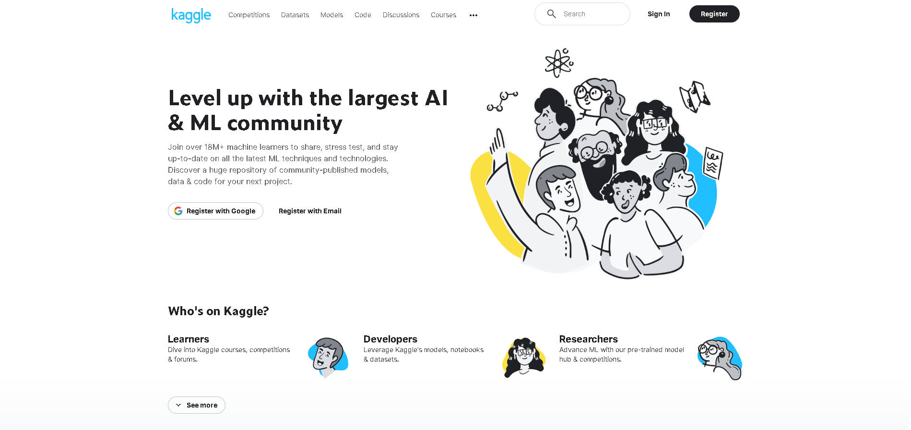
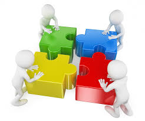

# Kaggle

# Este será un espacio donde compartir trabajos, pruebas, competiciones y resultados de las mismas, propuestas, etc relacionadas con los dataset de Kaggle.
# https://www.kaggle.com/
# TODOS los consejos, sugerencias, anotaciones, indicaciones, críticas (siempre que sean CONSTRUCTIVAS), comentarios, etc son y serán BIENVENIDOS.

  <a href="mailto:loquelojonove1975@gmail.com" target="_blank" rel = "noopener noreferrer" title="Email" rel="noopener"></i></a>

